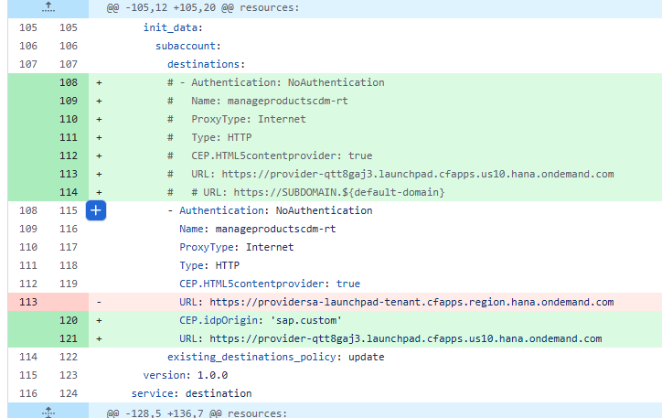
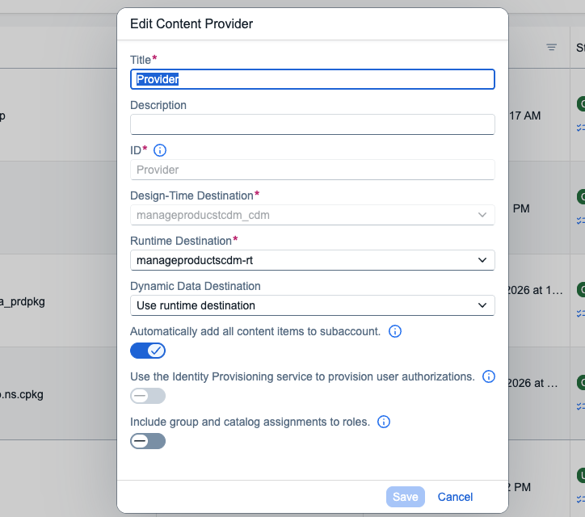

# Simple Business Solution that can be accessed as Content Provider

## Developers should find here -
1. Simple UI5 application called manage products that shows a list of products from generic Northwind service.
2. Very basic cdm.json file in workzone folder that contains 1 Role, 1 Group, 1 Catalog and 1 App.
3. Build script entry in mta.yaml to copy the cdm.json from workzone folder to resources folder.
4. Sap.cloud.service defined in the UI app manifest that denotes the business solution.
5. CDM and RT destinations defined within mta.yaml which can be used as reference while create the destinations in the consumer sub-account.

Refer the documentation [here](https://help.sap.com/docs/build-work-zone-advanced-edition/sap-build-work-zone-advanced-edition/developing-html5-apps-for-cross-subaccount-consumption) for details.

Prerequisites
Access to an SAP BTP Trial Global Account.
SAP Business Application Studio (BAS) or VS Code with SAP Fiori tools. 

Setup Instructions
1. Prepare the Content Structure

To expose your HTML5 application to the Work Zone Standard, you must define its metadata using the Common Data Model (CDM). 
Create a new folder named workzone in your project root.
Inside the workzone folder, create a file named cdm.json.
This file should define the roles, apps, and catalogs required for your site. Refer to the Guidelines for Creating a cdm.json for schema details.

2. Create a New SAP BTP Subaccount 

It is recommended to use a clean subaccount for this integration.  
Log in to the SAP BTP Cockpit.  
Navigate to your Global Account and create a new subaccount.  
Enable Entitlements: Ensure the subaccount has entitlements for SAP Build Work Zone, standard edition and HTML5 Applications.   
Enable Cloud Foundry environment and move 1 Quota from trial subaccount to the new created subaccount.  

3. Establish Trust in new created subaccount, using same IAS with trial subaccount
4. Subscribe SAP Build Work Zone, standard edition
5. Update configure of manageproductscdm-destination-service in mta.yaml file
Choose one subaccount as provider subacacount, the application will be deployed to it.
Then open you Workzone Standard application on it and record the URL,
For example: https://provider-qtt8gaj3.dt.launchpad.cfapps.us10.hana.ondemand.com/sites
Update mta.yaml,

Replace url with workzone standard url of your povider subaccount.
Remove '.dt.' and '/sites'.
6. Deployment & Integration
Build and Deploy: Deploy your HTML5 app to one of the BTP subaccounts(trial or new created subaccount).
This suaccount is used as provider subaccount.
7. Configure Destinations 
You need to create a destination so that SAP Build Work Zone can fetch and run your content. 
Sample Destination Configuration
Provider Subaccount 
[DesignTime](configfiles/manageproducstcdm_cdm.json)
[Runtime](configfiles/manageproductscdm-rt.json)

Consumer Subaccount
[DesignTime](configfiles/manageproducstcdm_cdm_c.json)
[Runtime](configfiles/manageproductscdm-rt_c.json)

8. Add application to Workzone Standard
Consumer Subaccount: Create Content Provider
